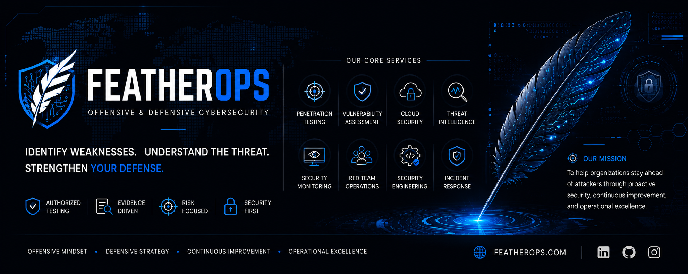
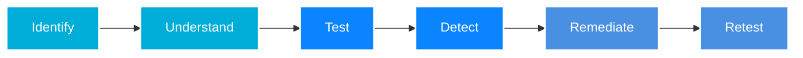
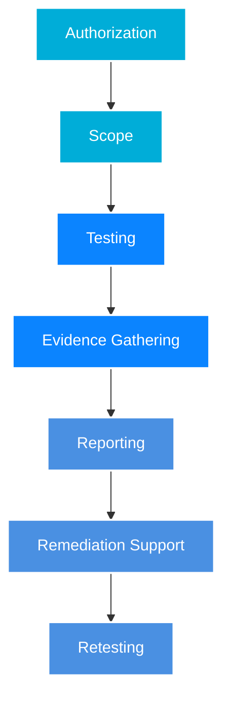

  

  <h1>FeatherOps Cyber Security</h1>
  
<b>Offensive & Defensive Cybersecurity Solutions</b>

  
  

    <i>Identify weaknesses. Understand the threat. Strengthen your defense.</i>
  

  

    
    
    
  

---

## 🛡️ About FeatherOps

FeatherOps is a premier cybersecurity firm focused on practical offensive and defensive security. We help organizations protect their critical assets by identifying vulnerabilities before malicious actors do. 

We combine elite security research, controlled penetration testing, vulnerability assessments, and defensive engineering to reduce security risk and ensure business continuity.

**Our Methodology:**

---

## 💼 Services for Clients

We offer comprehensive security services tailored to protect your business.

| Service | Description |
| :--- | :--- |
| 🔍 **Vulnerability Assessments** | Identify, validate, prioritize, and document security weaknesses across your infrastructure. |
| ⚔️ **Penetration Testing** | Authorized offensive testing and controlled attack simulation to find critical flaws. |
| 🌐 **Web & API Security** | Deep security testing for modern web applications, APIs, and cloud services. |
| 🛡️ **Defensive Security** | Infrastructure hardening, detection engineering, security monitoring, and incident response. |
| 🏗️ **Security Architecture** | Secure-by-design consulting, controls implementation, and security automation tooling. |

> 💡 **Ready to secure your infrastructure?** Reach out to us at [security@featherops.com](mailto:security@featherops.com) for a free consultation.

---

## 🛠️ Technology Stack & Capabilities

Our team leverages industry-leading tools and frameworks to deliver top-tier security services.

### Offensive Security

### Defensive Security & Infrastructure

### Development & Automation

---

## 🔬 Research & Intelligence

Our research is designed to be practical, reproducible, and responsible. We continuously study the latest threat vectors to ensure our clients are protected against cutting-edge attacks.

**Current Focus Areas:**
- Broken access control and API authorization (FO-RES-001)
- Modern ransomware attack patterns
- Cloud misconfigurations and privilege escalation
- Zero-trust architecture implementation

*Note: All security testing published by FeatherOps is performed against intentionally vulnerable applications, laboratory environments, or systems for which explicit authorization has been obtained.*

---

## 🔄 Engagement Lifecycle

Our structured engagement lifecycle ensures transparent, authorized, and highly effective security testing.

---

## 🤝 Partner With Us

We do not publish fabricated findings, fake CVEs, or unverified security claims. **Trust, Integrity, and Confidentiality** are the core pillars of our business. 

Whether you are a startup needing your first security audit, or an enterprise requiring advanced penetration testing, FeatherOps is here to help.

  <h3>Let's Secure Your Future.</h3>
  

 

  <strong>AUTHORIZED TESTING • EVIDENCE DRIVEN • RISK FOCUSED • SECURITY FIRST</strong>

  <small>© FeatherOps. All rights reserved.</small>

